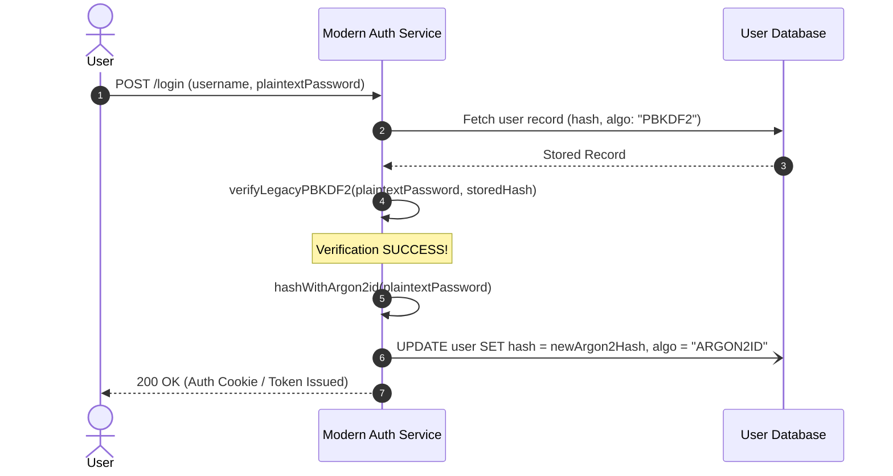

# Modernization Skill

This skill provides comprehensive architectural guidelines, migration patterns, and specification standards for decomposing legacy codebases, authoring target-neutral reconstruction blueprints, and executing safe, zero-downtime application modernizations.

It supports both **macro-level system modernizations** and **single-feature slice extractions** (e.g. extracting an IdentityServer Login or MFA flow into a modern standalone service).

---

## 1. Principles of Target-Neutral Specification

A target-neutral specification captures the fundamental intent, business logic, and operational invariants of a software system while remaining completely decoupled from legacy language or framework quirks.

### 1.1 Decoupling Business Rules from Framework Artifacts
- **Strip Framework Conventions:**
  - Strip framework-specific annotations (e.g., ASP.NET `[Authorize]`, Spring `@Transactional`, NestJS `@UseGuards()`).
  - Translate them into declarative invariants: *Pre-condition*, *Invariant*, *Authorization Rule*, *Atomicity Boundary*.
- **Pure Functional Core:**
  - Formulate domain calculations (cryptographic verification, lockout math, TOTP generation) as pure mathematical and logical functions with explicit inputs and outputs.
- **Explicit State Transitions:**
  - Model lifecycle entities as formal Finite State Machines (FSM). Document: Initial State, Valid Transitions, Triggers (Events), Transition Guards, and Side Effects.

---

## 2. Single-Feature Extraction & Modernization Patterns

When extracting a single feature (e.g., *Login Flow*, *MFA Challenge*, *Registration*) from a legacy codebase:

### 2.1 The Standalone Feature Microservice / Module Pattern
- Extract the feature into an independent, portable service or package (e.g., Fastify module, FastAPI service, Go Gin microservice, or serverless functions).
- Expose clear declarative contracts (OpenAPI 3.1) for public ingress.
- Define clean output ports for persistence and notifications so the feature can connect to existing databases during transition.

### 2.2 Rehash-on-Login Pattern (Zero-Disruption Cryptographic Modernization)
- **Problem:** Legacy system uses an outdated hashing algorithm (e.g., PBKDF2 with low iterations, or SHA-256). You want to modernize to Argon2id without forcing all users to reset their passwords.
- **Solution Strategy:**
  1. The modern service implements both the legacy verification algorithm and the modern Argon2id hasher.
  2. On user login, check password using the legacy algorithm.
  3. If verification succeeds: immediately compute the new Argon2id hash from the plaintext password.
  4. Asynchronously update the user's stored password hash and algorithm identifier in the database.
  5. Subsequent logins for that user verify directly against Argon2id.

### 2.3 Strangler Proxy Routing for Single Features
- Route only the extracted feature's endpoints through the API Gateway:
  - `POST /account/login` &rarr; Modern Authentication Service
  - `POST /account/mfa/verify` &rarr; Modern Authentication Service
  - `ALL OTHER ROUTES (/*)` &rarr; Legacy Monolith Application
- Share session authentication cookies or JWT signing keys between legacy and modern services during the coexistence window.

---

## 3. Data Migration & Cutover Strategies

Data migration carries the highest risk of operational failure. Blueprints must specify exact data synchronization protocols:

### 3.1 Dual-Write with Transactional Outbox
1. **Application-Level Dual Write:** The modern or legacy service writes to both databases within a transactional outbox to prevent split-brain states.
2. **Idempotency Keys:** Enforce unique idempotency keys on every transaction.

### 3.2 Shadow Traffic & Response Parity Testing
1. Configure the API Gateway to duplicate incoming read traffic (`GET` requests).
2. Forward the primary request to the legacy application (returning its response to the user).
3. Asynchronously forward the duplicated request to the modern target service.
4. Diff the responses (headers, status code, JSON body fields) in real time to verify parity.

---

## 4. Phased Modernization Roadmap Standards (Feature Extraction)

| Phase | Focus Area | Deliverables | Exit Criteria |
|---|---|---|---|
| **Phase 0** | Target Scaffold & OpenAPI Spec | Target workspace, OpenAPI 3.1 contract, CI pipeline | 100% automated CI build |
| **Phase 1** | Cryptographic & Rule Parity | Legacy password verifier, TOTP provider, lockout engine | 100% unit test pass rate matching legacy test fixtures |
| **Phase 2** | Ingress Routes & DB Adapters | Route handlers, repository connecting to user store | Full integration tests pass on DB snapshot |
| **Phase 3** | Strangler Routing & Shadow Run | Gateway route for feature, shadow response diffing | 0% divergence on shadow traffic |
| **Phase 4** | Production Cutover & Rehash | Shift 100% live feature traffic; trigger rehash-on-login | 100% production traffic with zero auth downtime |
| **Phase 5** | Legacy Monolith Cleanup | Delete legacy controller and retired dependencies | Monolith build succeeds without legacy feature code |

---

## 5. Modernization Review Checklist
- [ ] Feature extraction provides complete OpenAPI 3.1 contract.
- [ ] Rehash-on-login or credential migration strategy avoids forcing user password resets.
- [ ] Strangler Fig gateway routing isolates only the target feature routes.
- [ ] Explicit rollback mechanisms and emergency gateway fallback switches are defined.
